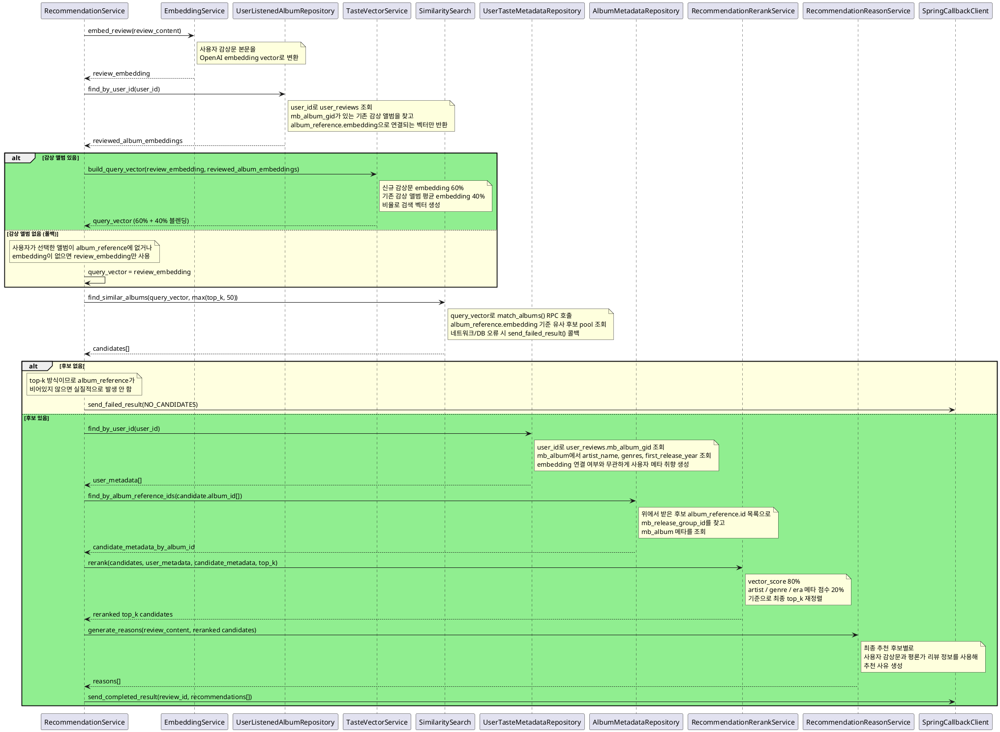

# [FastAPI] AI 추천 처리 + 콜백 전송

> 전체 플로우: [docs/flows/02-recommend.md](../../flows/02-recommend.md)

## 요구사항

**입력 검증**
- `user_id`는 필수값이다. 누락 시 422를 반환한다.

**취향 벡터 생성**
- `user_id`가 있으면 `user_reviews.mb_album_gid`로 감상한 앨범 임베딩을 조회해 취향 벡터를 생성한다.
- 취향 벡터 = 감상문 임베딩 × 0.6 + 감상 앨범 임베딩 평균 × 0.4
- 감상한 앨범이 없으면 감상문 임베딩 100%로 검색한다 (폴백).

**유사도 검색**
- 유사도 검색 대상은 `album_reference`로 고정한다.
- 추천 수는 `config.RECOMMENDATION_TOP_K` (기본값 3)로 관리한다. 변경 시 이 값만 수정한다.
- 메타 재순위를 위해 `match_albums()` 후보는 `max(RECOMMENDATION_TOP_K, 50)`개 조회한다.

**MusicBrainz 메타 재순위**
- `user_reviews.mb_album_gid`로 사용자의 기존 감상 이력 `mb_album` 메타를 조회한다.
- 후보는 `album_reference.id` → `mb_release_group_id` → `mb_album.gid`로 메타를 조회한다.
- 재순위 기준은 artist / genres / first_release_year다.
- 최종 점수는 `vector_score * 0.80 + meta_score * 0.20`이다.
- 메타 조회 실패 시 추천 실패가 아니라 기존 벡터 순서로 fallback한다.

**추천 사유 생성**
- 추천 사유는 유사도 검색 결과와 `review_content`를 함께 사용해 생성한다.

**Spring 콜백**
- FastAPI는 `user_reviews`, `recommend_album`을 직접 수정하지 않는다. 추천 결과 저장과 상태 전이는 Spring Boot 콜백에 위임한다.
- Spring 콜백 전송 실패 시 재시도 정책은 별도 결정 전까지 로그만 기록한다.

**인프라**
- 운영 경로에서 Repository는 FastAPI lifespan에서 생성된 DB client를 dependency provider를 통해 주입받는다.
- DB client 설정이 누락되면 `None.from_(...)` 같은 런타임 오류가 아니라 설정 누락 예외로 실패한다.

## 처리 흐름

## 관련 구성요소

| 단계 | 구성요소 | 역할 | 입력 | 출력 | DB/API |
|------|----------|------|------|------|--------|
| 1 | `embedding_service` | 감상문 임베딩 생성 | review_content | embedding vector | OpenAI Python SDK Embeddings API |
| 2 | `user_listened_album_repository` | 사용자 감상 앨범 임베딩 조회 | user_id | embedding[] | user_reviews → album_reference SELECT |
| 3 | `taste_vector_service` | 감상문 + 취향 벡터 블렌딩 | review_embedding, reviewed_album_embeddings | query_vector | - |
| 4 | `similarity_search` | `album_reference` 유사도 검색 | query_vector | 후보 pool | match_albums() RPC |
| 5 | `user_taste_metadata_repository` | 사용자 기존 감상 이력 메타 조회 | user_id | AlbumMetadata[] | user_reviews → mb_album SELECT |
| 6 | `album_metadata_repository` | 후보 앨범 메타 조회 | album_reference id[] | album_id별 AlbumMetadata | album_reference → mb_album SELECT |
| 7 | `recommendation_rerank_service` | artist / genre / era 기반 재순위 | 후보 pool, 사용자 메타, 후보 메타 | TOP K 앨범 | - |
| 8 | `recommendation_reason_service` | 앨범별 추천 사유 생성 | review_content, TOP K 앨범 | recommendationReason 목록 | OpenAI Python SDK Chat API |
| 9 | `callback_client` | Spring 처리 결과 콜백 전송 | review_id, COMPLETED/FAILED 결과 | - | POST Spring /api/user-reviews/{id}/recommendations |

## 테스트 시나리오

### Schema — `RecommendationSchemaTest`

콜백 item DTO는 외부로 단독 전송하지 않고, Spring 처리 결과 콜백 DTO의 `recommendations[]` 원소로 사용한다.

| 시나리오 |
|----------|
| 콜백 item DTO는 camelCase 필드 직렬화 |
| 성공 콜백 DTO는 `status=COMPLETED`와 `recommendations[]` 포함 |
| 실패 콜백 DTO는 `status=FAILED`, errorCode/message, 빈 `recommendations[]` 포함 |

### Service — `EmbeddingServiceTest`

| 시나리오 |
|----------|
| 감상문 본문 임베딩 성공 시 vector 반환 |
| OpenAI 임베딩 API 실패 시 도메인 예외 또는 실패 결과로 변환 |
| 설정된 `OPENAI_EMBEDDING_MODEL` 사용 |

### Service — `RecommendationServiceTest`

| 시나리오 |
|----------|
| 성공 경로는 임베딩 생성, 취향 벡터 합산, 후보 pool 검색, 메타 재순위, 추천 사유 생성, Spring 콜백까지 수행 |
| 후보 검색은 `max(RECOMMENDATION_TOP_K, 50)`개 조회 후 최종 콜백은 `RECOMMENDATION_TOP_K` 이하로 제한 |
| 콜백 score는 0.0000~1.0000 범위로 정규화 |
| 후보 0건이면 추천 사유 생성 없이 FAILED 콜백 전송 |
| 임베딩 실패 시 검색/LLM을 호출하지 않고 FAILED 콜백 전송 |
| 유사도 검색 실패 시 LLM을 호출하지 않고 FAILED 콜백 전송 |
| 콜백 전송 실패는 자동 재시도나 예외 전파 없이 로그만 기록 |
| user_id가 있고 매칭 앨범이 있으면 TasteVectorService로 블렌딩된 벡터로 검색 |
| user_id가 있어도 매칭 앨범이 없으면 review embedding 100%로 검색 |
| 메타 조회 실패는 기존 벡터 순서 fallback으로 처리 |
| 기존 감상 embedding 조회 실패는 감상문 embedding 검색으로 fallback |

### Repository — `AlbumEmbeddingRepositoryTest`

| 시나리오 |
|----------|
| DB client 없이 Repository를 생성하면 설정 누락 예외 발생 |
| TOP K 유사도 검색은 similarity DESC 정렬과 최대 K건 반환 |
| 조회 대상은 `album_reference`로 고정 |
| 후보 없음은 빈 리스트 반환 |
| DB 조회 실패는 도메인 예외로 변환 |

### Repository — `UserListenedAlbumRepositoryTest`

| 시나리오 |
|----------|
| user_id로 조회한 앨범의 embedding을 중복 제거 후 반환 |
| 감상한 앨범이 없으면 빈 리스트 반환 |

### Repository — `UserTasteMetadataRepositoryTest`

| 시나리오 |
|----------|
| user_id로 조회한 `mb_album_gid`를 중복 제거 후 `mb_album` 메타로 반환 |
| 선택된 MusicBrainz 앨범이 없으면 빈 리스트 반환 |
| genres 응답 형식이 깨지면 RepositoryError로 변환 |

### Repository — `AlbumMetadataRepositoryTest`

| 시나리오 |
|----------|
| `album_reference.id` 후보를 `mb_release_group_id`를 거쳐 `mb_album` 메타로 매핑 |
| 후보 id가 없으면 DB를 조회하지 않음 |
| 후보 메타 genres 응답 형식이 깨지면 RepositoryError로 변환 |

### Service — `RecommendationRerankServiceTest`

| 시나리오 |
|----------|
| 벡터 점수가 근접하면 사용자 메타 취향과 맞는 후보를 위로 올림 |
| 사용자 메타 프로필이 없으면 기존 벡터 순서를 유지 |
| 후보 메타가 없으면 해당 후보는 벡터 점수만 사용 |

### Service — `TasteVectorServiceTest`

| 시나리오 |
|----------|
| 감상문 임베딩(60%)과 감상 앨범 임베딩 평균(40%)을 블렌딩 |
| 감상 앨범이 없으면 감상문 임베딩 그대로 반환 |

### DTO — `RecommendByReviewRequestTest`

| 시나리오 |
|----------|
| `user_id` 누락 시 validation error 발생 |
| `user_id` 앞뒤 공백 제거 |
| 빈 문자열 또는 공백뿐인 `user_id`는 validation error 발생 |

### API Dependency — `RecommendationDependencyTest`

| 시나리오 |
|----------|
| `app.state.database`의 DB client를 Repository에 주입해 `RecommendationService` 생성 |
| DB client가 없으면 설정 누락 예외 발생 |
| endpoint 테스트는 `dependency_overrides`로 service를 교체하고 운영 DB client에 의존하지 않음 |

### Service — `RecommendationReasonServiceTest`

- asyncio.gather()는 입력 순서대로 결과를 반환하므로 album_id 매핑 순서는 별도 검증하지 않는다.

| 시나리오 |
|----------|
| 후보별 추천 사유 생성 |
| OpenAI SDK를 설정된 모델/timeout/retry로 호출 |
| 여러 후보 추천 사유를 async로 병렬 생성 |
| 프롬프트에 사용자 감상문, 앨범 정보, 리뷰 원문/요약 포함 |
| OpenAI Chat 실패 시 fallback 추천 사유 반환 |
| 빈 LLM 응답 시 fallback 추천 사유 반환 |
| fallback 키워드 매칭은 사용자 감상문과 후보 리뷰의 공통 음악 키워드 반영 |

### Client — `SpringCallbackClientTest`

| 시나리오 | 기댓값 | 테스트 메서드 |
|----------|--------|---------------|
| 성공 콜백 | 올바른 URL과 `status=COMPLETED` payload로 POST | `sendCompletedResult_postsExpectedPayload` |
| 실패 콜백 | 올바른 URL과 `status=FAILED` payload로 POST | `sendFailedResult_postsExpectedPayload` |
| Spring 콜백 응답 body 없음 | Spring이 200 OK + empty body를 반환하면 성공 처리 | `sendRecommendations_emptySpringResponseBody200_success` |
| 4xx/5xx 응답 | 콜백 전송 실패로 기록 | `sendRecommendations_non2xx_raisesCallbackError` |
| timeout | 콜백 전송 실패로 기록 | `sendRecommendations_timeout_raisesCallbackError` |

### `RecommendationFlowIntegrationTest`

| 시나리오 | 기댓값 |
|----------|--------|
| user_id 누락 요청 | 422 반환 |
| user_id 포함 유효 요청 | 202 반환 후 service에 user_id 전달 확인 |

## 관련 API

- [API_SPEC.md — Recommendation API](../../API_SPEC.md#3-recommendation-api)
- [API_SPEC.md — POST /api/user-reviews/{reviewId}/recommendations](../../API_SPEC.md#post-apiuser-reviewsreviewidrecommendations)
