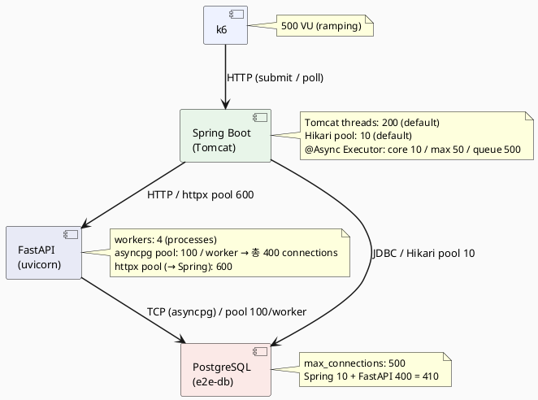

# 500VU 부하 테스트 최적화 기록

## 요청 흐름

### 1단계 — 감상문 제출 (k6 → Spring → FastAPI)

**k6** 가 500 VU로 요청을 보내면, **Tomcat 스레드** (최대 200개)가 수신한다. Tomcat이 202를 즉시 반환할 수 있는 이유는 실제 추천 처리를 직접 하지 않기 때문이다 — `INSERT user_review` 후 `@Async recommendationTaskExecutor` (core 10 / max 50 / queue 500)에 이벤트를 위임하고 바로 반환한다. Tomcat 스레드 점유 시간이 수ms에 불과하므로 200개로 500 VU를 소화할 수 있다.

202를 받은 k6는 3초 간격으로 polling을 시작한다.

위임받은 **executor 스레드**는 FastAPI에 `POST /recommend/review`를 전송한다 (httpx pool 600).

### 2단계 — FastAPI 추천 처리 (FastAPI → PostgreSQL → Spring 콜백)

**FastAPI uvicorn worker** (4개 프로세스)가 요청을 받아 BackgroundTask로 등록하고 즉시 202를 반환한다. 각 worker의 asyncio event loop가 추천 파이프라인을 비동기로 실행한다.

- `asyncio.gather()`로 personalization_lookup과 pgvector_search를 **병렬** 실행
  - 두 조회 모두 **asyncpg pool** (worker당 100개, 4워커 = 총 400 connections)으로 PostgreSQL에 직접 연결
- rerank → reason_generation 순차 실행
- 완료 후 Spring 콜백 API에 `POST /callback` 전송 (httpx pool 600)

**Spring** 은 콜백을 받아 **Hikari pool** (10개)로 `recommend_album INSERT` + `status=COMPLETED` UPDATE 처리. 트랜잭션 커밋 후 `review_embedding` UPDATE는 `@Async AFTER_COMMIT`으로 best-effort 처리한다.

k6 polling이 `status=COMPLETED`를 확인하면 iteration 완료.

---

## 인프라 구조



---

## 배경

k6 부하 테스트(500VU, ramping: ramp-up 30s → hold 3m → ramp-down 30s)에서 완료율 미달과 평균 처리 시간 45초 문제를 단계적으로 진단·개선한 기록이다.

---

## 테스트 환경

| 항목 | 구성 |
|---|---|
| k6 시나리오 | 500 VU ramping, `recommendation-e2e.js` |
| Spring Boot | docker-compose 로컬, Hikari pool |
| FastAPI | 4 uvicorn workers |
| DB | 초기: 실제 Supabase / 개선 후: 로컬 PostgreSQL + asyncpg |
| 측정 도구 | Grafana + Prometheus (`jazzmate_recommendation_stage_duration_seconds`) |

---

## 단계별 진단 및 수정

### Stage 1 — 초기 상태 (완료율 88.2%)

**증상:** 완료율 88.2%, 평균 처리 시간 45초

**원인:** FastAPI의 httpx AsyncClient `max_connections=100`. 500 in-flight 중 400개가 연결 대기.

**수정:** `max_connections=100 → 300`, `max_keepalive_connections=20 → 100`

```python
# backendPython/app/main.py
httpx.AsyncClient(limits=httpx.Limits(max_connections=300, max_keepalive_connections=100))
```

---

### Stage 2 — spring_callback 병목 (완료율 98.3%, spring_callback ~22초)

**증상:** httpx pool 확장 후 완료율은 올랐지만 spring_callback 스테이지가 22초 지배.

**원인:** FastAPI 콜백 트랜잭션 내에서 `review_embedding vector(1536)` UPDATE가 `saveAll`(추천 앨범 3건 INSERT)과 같은 트랜잭션에 묶여 있어, 1536차원 벡터 직렬화 비용이 Hikari connection 점유 시간을 늘림.

**수정:** embedding 저장을 `@TransactionalEventListener(AFTER_COMMIT)` + `@Async`로 분리.

```java
// 트랜잭션 완료 후 best-effort로 embedding 저장
eventPublisher.publishEvent(new ReviewEmbeddingSaveEvent(reviewId, request.getReviewEmbedding()));
```

> **주의:** `@TransactionalEventListener`와 `@Transactional`을 함께 쓸 때는 반드시 `propagation = Propagation.REQUIRES_NEW` 필요 (Spring 6 제약).

---

### Stage 3 — 비동기 분리 후 in-flight 폭발 (완료율 89.7%, timeout 282건)

**증상:** embedding 비동기 분리로 콜백 트랜잭션이 빨라지면서, Spring executor가 FastAPI에 더 빠르게 요청을 보냄 → in-flight 300 폭발 → FastAPI 처리 지연.

**원인 분석:** 콜백 처리가 느릴 때는 그게 자연스러운 back-pressure로 작용해 요청 속도를 억제하고 있었음. 비동기 분리로 그 제약이 사라지면서 원래 의도대로 요청이 몰린 것.

**잘못된 시도:** Hikari pool 확장(`maximum-pool-size=30`) → 오히려 악화 (86.1%). Hikari는 병목이 아니었음. 근본 원인은 다음 Stage에서 확인.

---

### Stage 4 — asyncio 블로킹 발견 (완료율 86.1% → 원인 확정)

**증상:** DB 쿼리 자체는 수ms인데 `personalization_lookup`이 28초, `pgvector_search`가 22초.

**원인:** supabase-py의 `.execute()`가 **동기 호출**이었음. uvicorn worker(asyncio event loop)에서 sync I/O를 호출하면 해당 worker 전체가 블로킹됨.

```
500 VU → 4 worker
각 worker에 125개 요청 → 1개가 sync DB 호출 중이면 나머지 124개 모두 대기
```

**수정:** supabase-py `create_client` → `acreate_client` (async client)로 교체. 모든 `.execute()` → `await .execute()`.

---

### Stage 5 — supabase async client (완료율 99.6%, 0 timeout)

**증상:** 완료율 급상승, 하지만 PostgreSQL `max_connections=100`이 새 병목.

**원인:** 4 worker × async → 동시 DB 연결 수가 100 초과.

**수정:** `docker-compose.db-real.yml`에 `max_connections=500` 추가.

---

### Stage 6 — supabase-py egress 문제 발견

**증상:** 로컬 DB를 쓴다고 설정했는데 실제 Supabase egress가 증가.

**원인 분석:**
- `docker-compose.db-real.yml`의 ai-api가 `env_file: ../.env`로 실제 `SUPABASE_URL`을 그대로 로드
- 로컬 DB(`e2e-db`)는 순수 PostgreSQL인데, supabase-py는 **PostgREST HTTP API**를 통해 쿼리 → 실제 Supabase 서버로 나감

**해결 방향:** supabase-py 대신 asyncpg로 직접 PostgreSQL 연결.

---

### Stage 7 — asyncpg 도입 (완료율 99.98%, timeout 1건, 로컬 500건 기준)

**변경 내용:**

1. `app/repositories/pg/` 디렉토리에 asyncpg 기반 구현체 5개 신규 작성
   - `PgAlbumEmbeddingRepository` — SQL로 직접 pgvector 코사인 유사도 검색
   - `PgAlbumMetadataRepository`
   - `PgUserListenedAlbumRepository` — JOIN으로 2-step 조회를 1-step으로
   - `PgUserReviewEmbeddingRepository`
   - `PgUserTasteMetadataRepository`

2. `app/api/dependencies.py` — `app.state.pg_pool` 존재 여부로 구현체 분기 (기존 supabase 구현체 유지)

3. `app/main.py` — `DATABASE_URL` 환경변수가 있으면 asyncpg pool 생성, 없으면 기존 supabase-py 사용

```
# asyncpg: TCP → PostgreSQL wire protocol (직접)
# supabase-py: HTTP → PostgREST → PostgreSQL
```

4. asyncpg의 pgvector 타입 처리: pool `init` 콜백에서 `set_type_codec("vector", schema="public", format="text")`

5. 로컬 DB init SQL(`polling-fake-db-init.sql`)에 `album_reference`, `mb_album` 테이블과 `match_albums` 함수 추가. 3만건 앨범 임베딩을 `setseed` + LATERAL 방식으로 빠르게 생성.

---

### Stage 8 — spring_callback httpx pool 확장 (완료율 99.92%, timeout 4건, 로컬 3만건 기준)

**증상:** 3만건 앨범으로 테스트 시 `spring_callback` 스테이지가 40초 이상으로 지배적. Hikari pending=0, Tomcat busy 최대 16개로 Spring 자체는 여유 있음.

**원인:** 500 in-flight 요청이 모두 spring_callback 단계에 몰릴 때 httpx `max_connections=300`으로는 200개가 연결 대기. Spring이 빠르게 처리해도 연결 자체를 못 잡고 대기.

**수정:** `max_connections=300 → 600`, `max_keepalive_connections=100 → 200`

---

### Stage 9 — personalization_lookup + pgvector_search 병렬화

**원인:** 두 스테이지가 순차 실행 (각 ~25초 → 합산 ~50초).

**수정:** `asyncio.gather()`로 병렬 실행.

```python
(previous_review_embeddings, listened_album_embeddings), candidates = await asyncio.gather(
    _personalization_lookup(),
    _pgvector_search(),
)
```

> **트레이드오프:** pgvector_search가 personalization 결과를 반영한 taste_vector 대신 raw embedding으로 검색하게 됨. 추천 정확도보다 응답 속도를 우선하는 결정. 추천 정확도를 유지하려면 순차 실행 필요.

---

## 최종 설정값

| 항목 | 변경 전 | 변경 후 |
|---|---|---|
| FastAPI DB 클라이언트 | supabase-py | asyncpg connection pool |
| asyncpg pool size | — | `DATABASE_POOL_SIZE=100` (worker당 100, 4워커 = 400 연결) |
| httpx max_connections (Spring 콜백) | 100 | **600** |
| httpx max_keepalive_connections | 20 | 200 |
| Spring Hikari pool | 10 (기본) | 10 (변경 없음) |
| PostgreSQL max_connections | 100 (기본) | 500 |
| embedding 저장 | 콜백 트랜잭션 내 동기 | `@Async` + `AFTER_COMMIT` 이벤트 |

---

## 결과 비교

| 지표 | 초기 | 최종 (asyncpg, 로컬 3만건) |
|---|---|---|
| 완료율 | 88.2% | **99.92%** |
| 타임아웃 | 다수 | **4건** |
| 평균 처리 시간 | ~45초 | ~21초 |
| p(95) 처리 시간 | — | ~60초 |
| submit p(95) | — | 26ms |

> **주의:** 최종 테스트는 로컬 DB 3만건 기준. 실제 Supabase(13만건 pgvector 검색)에서는 pgvector_search 구간이 더 길어질 수 있음.

---

## 남은 과제

- 실제 Supabase 13만건 pgvector 검색 성능 측정 필요 (로컬 3만건과 조건 상이)
- asyncpg 도입 후 실제 프로덕션 배포 시 `DATABASE_URL` 환경변수 구성 필요
- personalization_lookup + pgvector_search 병렬화 적용 시 추천 정확도 영향 검토
